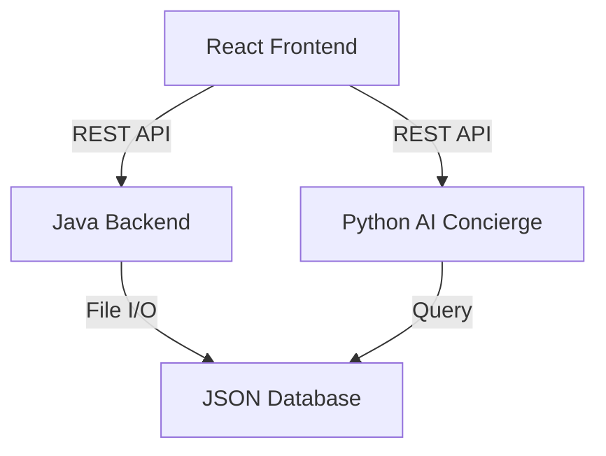

# SkyVoyage Project Report

## 1. Executive Summary
**SkyVoyage** is a high-performance, full-stack flight booking and management platform. It combines a robust Java-based backend engine with a modern React frontend and a Python-powered AI concierge. The platform is designed to provide a seamless travel experience, from searching for flights to managing complex bookings and loyalty programs.

---

## 2. Project Architecture
The project follows a distributed architecture with three primary services interacting to provide the full user experience.

### 2.1 Technology Stack
| Layer | Technologies |
| :--- | :--- |
| **Frontend** | React, Vite, Tailwind CSS, Lucide Icons, Framer Motion |
| **Backend (Core)** | Java 17+, Custom HTTP Server, Multi-threaded flight processing |
| **Backend (AI)** | Python, FastAPI, Chatbot Engine |
| **Database** | File-based JSON Storage (airports, flights, bookings) |
| **Deployment** | PowerShell/Batch build scripts |

---

## 3. Key Modules & Features

### 3.1 Flight Search & Booking Engine
*   **Dynamic Search**: Filter flights by origin, destination, and date.
*   **Real-time Availability**: Simulated live flight updates using Java multi-threading.
*   **PNR Generation**: Automatic creation of unique Passenger Name Records (PNR) upon booking.
*   **Confirmation Flow**: Interactive multi-step booking process with passenger details.

### 3.2 SkyGuide AI Concierge
*   **Conversational Interface**: A Python-based AI assistant integrated into the frontend.
*   **Contextual Help**: Answers queries about flight status, booking procedures, and travel tips.

### 3.3 Admin Dashboard
*   **System Monitoring**: Real-time view of system performance and service status.
*   **Booking Management**: Admins can view, search, and manage all global bookings.
*   **Secure Access**: Protected login portal for administrative tasks.

### 3.4 Loyalty & Privileges
*   **Loyalty Program**: Tiered rewards system (Silver, Gold, Platinum).
*   **SkyPrivileges**: Exclusive benefits for frequent flyers, including lounge access and priority boarding.

---

## 4. Implementation Details

### 4.1 Java Backend (The Engine)
The backend is built from scratch without heavy frameworks like Spring, demonstrating core Java proficiency:
*   **Controllers**: Handle HTTP requests for Auth, Bookings, and Flights.
*   **Services**: `StorageManager` for persistence and `LiveFlightService` for simulation.
*   **Multi-threading**: Utilizes Java threads to manage concurrent flight simulations and server tasks.

### 4.2 React Frontend (The Interface)
*   **Component-Driven**: Highly modular UI with reusable components for tables, modals, and forms.
*   **State Management**: Uses React hooks (useState, useEffect) and Context API for global state.
*   **UX/UI**: Modern design aesthetics with dark/light mode support and smooth transitions.

### 4.3 Data Persistence
Instead of a traditional SQL database, the project uses a structured JSON file system:
*   `flights.json`: Master schedule.
*   `bookings.json`: Active and historical passenger records.
*   `airports.json`: Global airport directory.

---

## 5. Security & Validation
*   **PNR Integrity**: Validation of booking references during lookup.
*   **Admin Auth**: Credential-based access control for management features.
*   **Input Sanitization**: Client and server-side validation for passenger data.

---

## 6. Future Enhancements
1.  **Payment Gateway Integration**: Adding real payment processing (Stripe/PayPal).
2.  **Global API Integration**: Fetching real-world flight data from Amadeus or Skyscanner APIs.
3.  **Mobile App**: Developing a companion mobile application using React Native.
4.  **Advanced Analytics**: Implementing a data visualization suite for admin flight statistics.

---
**Report Generated By**: SkyVoyage Development Team
**Date**: April 27, 2026
